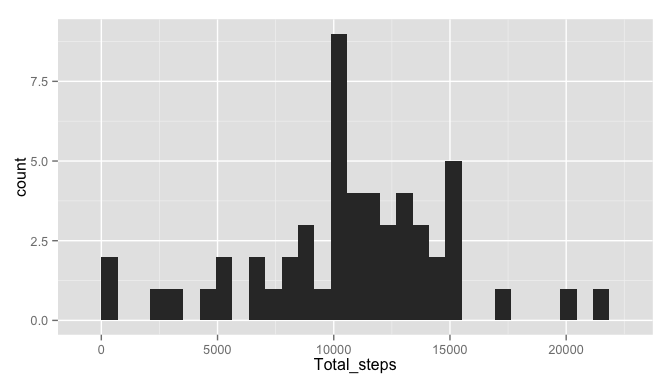
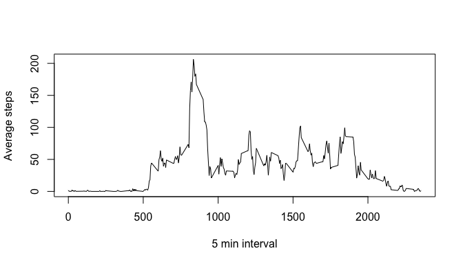
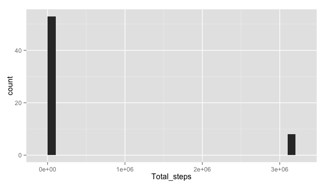
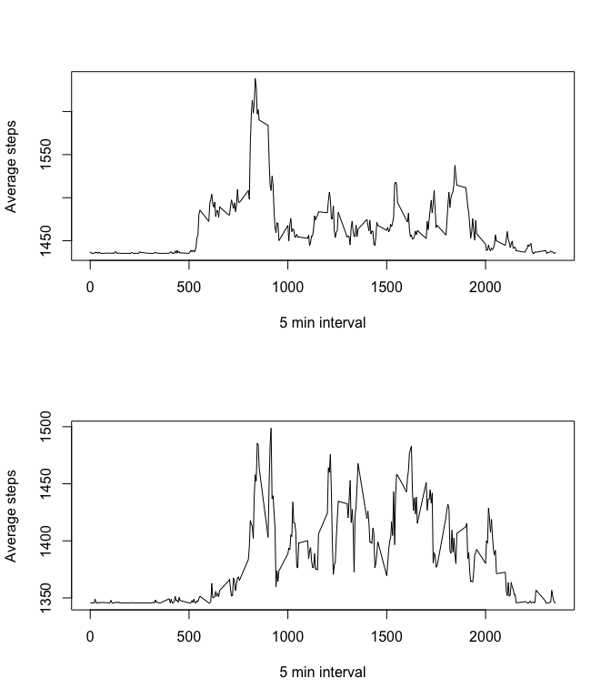

# PA1_template
Read the data given in the assignment into activityData, we take into consideration only the complete cases, and discard NA values and store the result in ComplActivity.

Calculate the data frames for part 1 & 2 of the assignments which will help us build the plots.


```r
activityData <- read.csv("activity.csv")
library(dplyr)
```

```
## 
## Attaching package: 'dplyr'
## 
## The following object is masked from 'package:stats':
## 
##     filter
## 
## The following objects are masked from 'package:base':
## 
##     intersect, setdiff, setequal, union
```

```r
library(ggplot2)
library(timeDate)
ComplActivity <- activityData[complete.cases(activityData),]
activity_byday <- group_by(ComplActivity, date)

steps_sum <- summarize(activity_byday, sum(steps))
colnames(steps_sum) <- c("day", "Total_steps")
activity_byinterval <- group_by(ComplActivity, interval)

avgSteps <- summarize(activity_byinterval, mean(steps))
colnames(avgSteps) <- c("interval", "average_steps")

meanSteps <- mean(steps_sum$Total_steps)
medianSteps <- median(steps_sum$Total_steps)

max <- avgSteps[which.max(avgSteps$average_steps),]
MaxInt <- max$interval
```
## Part 1 plot

A histogram of the total number of steps taken per day and Mean & Median of the total number of steps taken per day.


```r
qplot(Total_steps,data = steps_sum)
```

```
## stat_bin: binwidth defaulted to range/30. Use 'binwidth = x' to adjust this.
```

 

Now we got our mean which is 1.0766189\times 10^{4} and median which is 10765 of the total number of steps taken per day.

## Part 2 plot

Make a time series plot (i.e. type = "l") of the 5-minute interval (x-axis) and the average number of steps taken, averaged across all days (y-axis).
Calculate the  5-minute interval, on average across all the days in the dataset, contains the maximum number of steps.


```r
plot(avgSteps$interval,avgSteps$average_steps, typ="l", xlab="5 min interval", ylab = "Average steps")
```

 

The 5 min interval, on the average across all the the days in the dataset, contains the maximum number of steps is 835

## Part 3 
The na values in the data set have been replaced by median of total number of steps taken per day. 


```r
activityData <- read.csv("activity.csv")
NaValues <- length(which(is.na(activityData$steps)))
activityData[["steps"]][is.na(activityData[["steps"]])] <- median(steps_sum$Total_steps)
NewActivityData <- activityData
NewAct_byday <- group_by(NewActivityData, date)
NewStepsSum <- summarize(NewAct_byday, sum(steps))
colnames(NewStepsSum) <- c("day", "Total_steps")
NewMeanSteps <- mean(NewStepsSum$Total_steps)
NewMedianSteps <- median(NewStepsSum$Total_steps)
```

Total number of missing values in the dataset is 2304. The new mean is 4.1595357\times 10^{5} and new median is 11458. Which seem to be very different from the part 1.


```r
qplot(Total_steps, data= NewStepsSum)
```

```
## stat_bin: binwidth defaulted to range/30. Use 'binwidth = x' to adjust this.
```

 
## Part 4
First we create a new column day to show the day of the week. Then sort the data based on whether it
is weekday or weekend. And finally plot the graph for average steps according to the interval. From the plot it's clear the activity is not the same for weekend and weekday.


```r
NewActivityData4 <- mutate(NewActivityData, day = weekdays(as.Date(date))) 
NewActivityData4[["day"]][isWeekday(NewActivityData4[["date"]])] <- "Weekday"
NewActivityData4[["day"]][isWeekend(NewActivityData4[["date"]])] <- "Weekend"
Act_byWeekend <- NewActivityData4[NewActivityData4$day == "Weekend",]
Act_byWeekday <- NewActivityData4[NewActivityData4$day == "Weekday",]

WeekendAct_byInt<- group_by(Act_byWeekend, interval)
WeekdayAct_byInt<- group_by(Act_byWeekday, interval)

AvgSteps_Weekday <- summarize(WeekdayAct_byInt, mean(steps))
colnames(AvgSteps_Weekday) <- c("Interval", "Average_steps")
AvgSteps_Weekend <- summarize(WeekendAct_byInt, mean(steps))
colnames(AvgSteps_Weekend) <- c("Interval", "Average_steps")
```


```r
par(mfrow= c(2,1))
plot(AvgSteps_Weekday$Interval, AvgSteps_Weekday$Average_steps, typ="l", xlab="5 min interval", ylab = "Average steps")
plot(AvgSteps_Weekend$Interval, AvgSteps_Weekend$Average_steps, typ="l", xlab="5 min interval", ylab = "Average steps")
```

 


